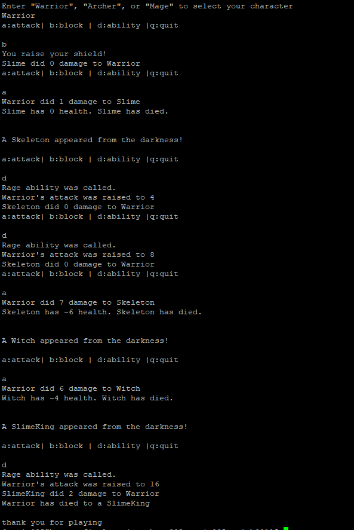
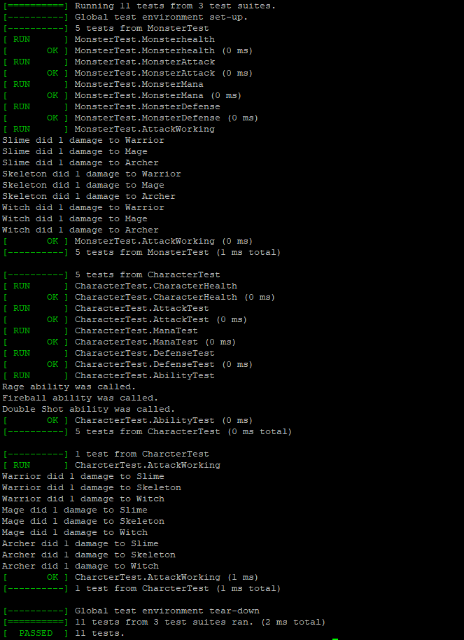

# RPG project
 
  Authors: [Sathya Rajesh](https://github.com/sraje005),
   [Adolfo Nieblas](https://github.com/AdolfoNieblas),
            [Hyun Bin Won](https://github.com/hyunwin)

## Project Description
  We are creating a text based RPG(Role-playing game). We are using a base class called Entity, that has two different constructors. One of the constructors is parameterized, 
  and takes in an Ability pointer for the hero characters, and the other constructor would be used for all of the derived monsters.
  This entire game will be played entirely through a text interface such as the command line in a linux terminal, without the need for any kind of mouse inputs.
  This project is interesting to us because we feel that it is a good way to further our understanding of inheritance and polymorphism, as well as a good way to implement
  different types of design patterns, especially as we keep building upons the actions that the player can use. 
 
#### Languages and Tools:
  [Visual studios](https://visualstudio.microsoft.com/) - A professional IDE for C++
     
  [C++](https://www.cplusplus.com/) - This project will be programmed primarily using C++ 11.
     
  [Valgrind](https://valgrind.org/) - Valgrind is a Linux tool which detects errors and memory management bugs in C++ code. We will use it to fix memory leaks in our code.
  
  [Google Test Framework](https://github.com/google/googletest) - This will allow us to test the functionality and edge cases for our program. It will allow us to test the the valid/invalid inputs that our program will accept during the duration of the program.
    
  [Vim](https://www.vim.org/) - Vim is a text editor that allows us to edit code in Linux.
    
  [Github](https://github.com/) - GitHub is a version control system that allows multiple users to share and edit code together online, as well as manage the development of the project.
    
  [Lucidchart](https://www.lucidchart.com/) - Lucidchart will be used to make OMT class diagrams and other program diagrams for our project.

#### Program inputs/outputs:
 
  Input: The only input will come from using the keboard. As a player input from the keyboard will be used to select a charater type, and to be able to attack, use abilities, and use items.
  
  Output: The ouput consists of updating our charater's status every turn, as well as updating the status of the monster you are interacting with.
 
## Design patterns

#### Strategy:
  We will be implementing this design pattern for the attacking abilities of each of our character derived classes. We want each derived character to do a have a separate ability that consumes different amounts of mana, and does a different amount of damage for each. To avoid writing the same type of code for each character, a strategy pattern would be a good solution to this problem. Using this pattern, we would also be able to add other abilities in the future and are also able to change the set Abilities of a character to another. Using this pattern we will have to make sure that we call the correct functions when an Entity points to that ability.

#### Decorative:
  We chose a decorative design pattern as our second pattern because we wanted to implement a feature where each character and enemy can receive buffs and debuffs that add new functionality to the existing character and enemy but it won’t alter their structure. Using this pattern we will also be able to alter the functions in the Entity base class in any of the derived classes. A problem that we anticipate encountering when implementing our project that would be solved using this design pattern would be that giving the characters and enemies new functionality without alternating the object. This design pattern will lead our team to a good solution to the problem because creating the pattern will simplify what we have to do.

## Class Diagram
 
 Above is the OMT for the RPG project. The diagram shows that the client will only be interacting with the interface of the program. The Interface will contain all the functions used to display the game, and all the interactions that the player will have when selecting a character. To implement this, we created member objects to allow us to use the functions within the Entity class. When choosing a character, the CharSelector() will be used, and depending on the choice, will create the appropriate class, pass a defined Ability as a parameter and assign it to Entity Chosen. Once done, the Entity will have access to the Attack(), Block(), and useAbility() functions. The Interface will also handle the storage of the monsters you will be fighting as well as displaying the actions taken by both the player and the current monster. The interface has a turn-based system that will allow the player to attack, block, or use their ability, and then immediately follow it with the attack by the current monster you are facing. At any point, the player will be able to quit and the game will end. 
Within the Entity class, we have made two constructors to be used by the characters and the monsters. We set all the entity stats as member functions and have getters and setters to access or manipulate them. There is also a boolean function that checks if an entity isAlive, and will return true as long as the health does not go to zero or below. We have a function that goes the the Ability interface called useAbility(), and it will be used by the characters only. There is also a function that sets the ability of the character to be able to change at a later time is needed. All the characters and monsters are derived from the same Entity class.
The Ability interface is an abstract class. The only function that will be implemented and used within the derived classes is the useAbilityBehavior(). These functions take in the attack, mana, and health stats from the Entity object using it and will return an integer with the amount of damage done by the ability used.

 ## Screenshots
#### Input/Output:


#### Tests:


## Installation/Usage
 Using git, clone the repository, and `cd` into it.
```
git clone https://github.com/cs100/final-project-hwon002-sraje005-anieb001
cd final-project-hwon002-sraje005-anieb001
```

This project uses `cmake` as well as `make` After they’re installed, the following commands can be run to create executables.
```
cmake .
make
```

The following executables will be created

```
main
test
```

Running `./main` will run the game, and will start to ask the user for input.

The program starts by prompting the user to choose which of the three characters (Warrior, Archer, Mage) they would like to play as.
After choosing which character you want to play as, an ability is automatically assigned to your character.
Immediately after the character creation, you will be able to fight a set number of monsters. You are able to attack, block, or use your ability to interact with the monster.
The program will continue to run until all the monsters are defeated or until the user's character loses all their health or if the user specifically types 'q' to quit.
 
 ## Testing
The program was tested through the use of the Google Test Framework (Installation instructions in the link above). After having used `cmake .` and `make`, you will be able to run the tests we made using `./test`. Our tests made sure that the correct functions were called, also that the correct objects were constructed when given parameters or not. We also used Valgrind to lower the amount of memory leak (Installation instructions in link above).
